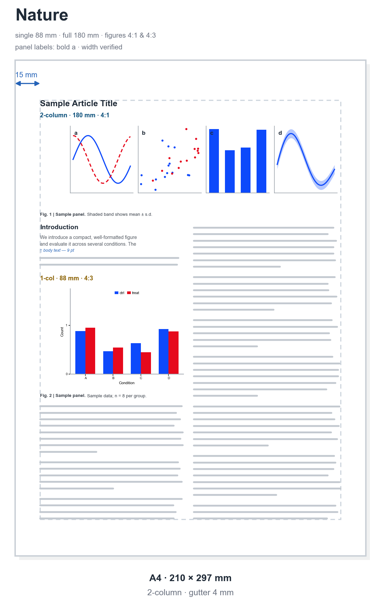
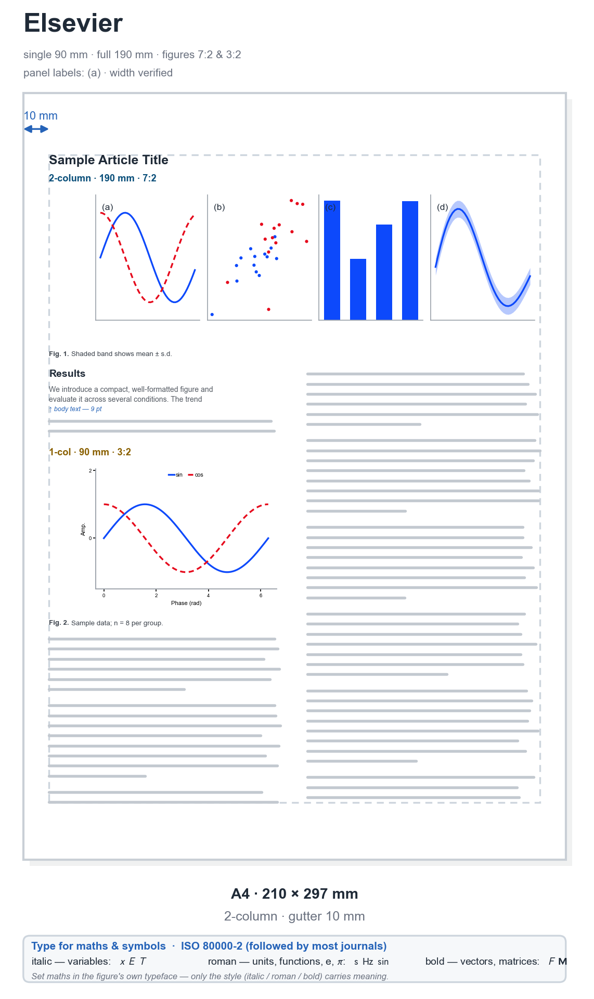
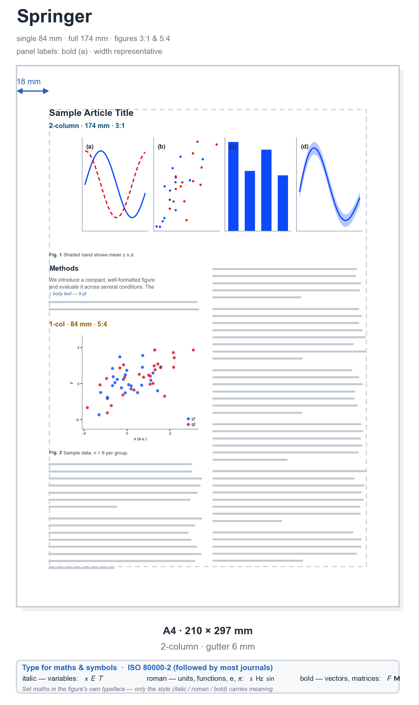
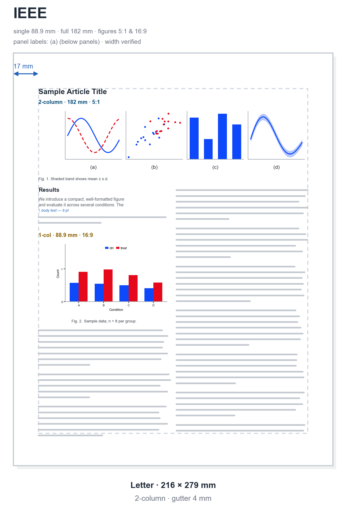
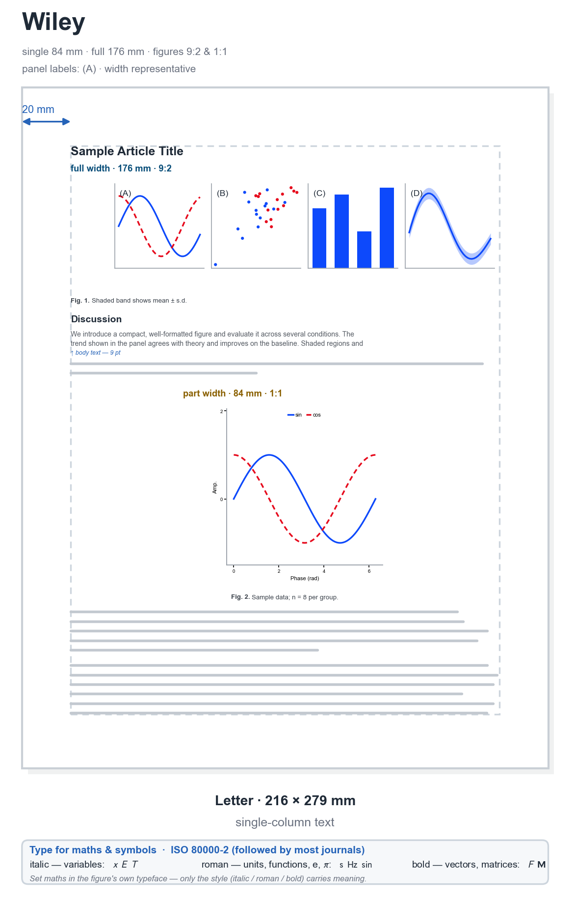
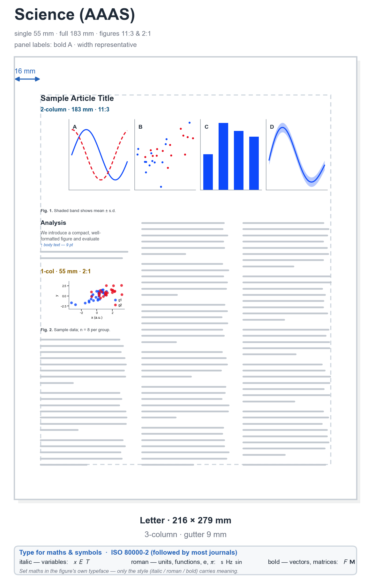

# Scientific Plotting & Presentation Conventions

What each major journal **requires** of a figure — size, resolution, fonts, formats, color and
panel labels — and the **matplotlib commands** that meet those requirements, with to-scale
schematics of how each publisher expects a figure to look. A style sheet is bundled for
convenience, but the requirements and the commands are the point — not the style file.


> **The one rule that explains all the others:** *build the figure at the exact physical size it
> will be printed or projected.* Never draw it big and shrink it in Word/LaTeX/PowerPoint —
> scaling silently pushes fonts and line weights below the legibility limits and makes panels
> inconsistent. Set the size in **inches/mm**, the font in **points**, and what you see is what
> the reader gets.

---

## Part 1 · Set up before you plot

*Lock these in **before you draw anything** — the canvas size and the type. Get them right and the rest follows.*

### Figure size

**Think in physical units, not pixels.** A figure has a true size in inches/mm; pixels only
appear when you rasterize (`width_px = width_in × dpi`).

- **Match the column grid.** Most journals are two-column — make figures single-column (~89 mm)
  or full-width (~180 mm) so they drop in without scaling. Some allow a "1.5-column"
  (~120–136 mm) for wide panels.
- **Keep height modest.** A figure may not exceed the printable page height (~240 mm incl.
  caption); tall figures get shrunk by the typesetter, which re-shrinks your fonts.
- **Pick a deliberate aspect ratio.** Golden ratio (height ≈ 0.618 × width) or 4:3 reads well;
  square suits matrices/heatmaps; wide/short suits time series.

`figsize` is **in inches** — set it once and design at 1:1:

```python
fig, ax = plt.subplots(figsize=(3.5, 2.16))   # single-column Nature, ~golden ratio
```

A tiny helper keeps you in physical units and consistent ratios:

```python
def fig_size(width_mm, aspect=0.618, fraction=1.0):
    """Return (width, height) in INCHES for a target column width in mm."""
    width_in = (width_mm / 25.4) * fraction
    return (width_in, width_in * aspect)

fig, ax = plt.subplots(figsize=fig_size(89))    # single column
fig, ax = plt.subplots(figsize=fig_size(183))   # double column
```

> **Gotcha — "tight" cropping silently overrides `figsize`.** Cropping to the artists makes the
> saved size differ from `figsize`. It's triggered two ways: passing **`bbox_inches="tight"`** to
> `savefig()` (the obvious one; `tight_layout()` is the on-screen equivalent), **or** the
> **`savefig.bbox`** rcParam being set to `tight` — then *every* save crops, even when you never
> pass `bbox_inches`. Some style packages set it (e.g.
> [SciencePlots](https://github.com/garrettj403/SciencePlots)), so a figure can come out the wrong
> size for no visible reason. For an exact `figsize`, let `constrained_layout` handle the margins
> and keep cropping off:
> ```python
> plt.rcParams["savefig.bbox"] = "standard"   # matplotlib's default; undo any package that forced 'tight'
> ```
> (The bundled [`convention.mplstyle`](convention.mplstyle) ships `savefig.bbox: standard` for this reason.)

### Fonts & font size

Every label must be readable at print size.

- **Use one sans-serif face.** **Arial** / **Helvetica** are the de-facto journal standard
  (DejaVu Sans is matplotlib's bundled look-alike if Arial isn't installed).
- **Small but legible** — aim for ~7 pt, treat **~5 pt as the floor**; similar to or slightly
  smaller than the article body text.
- **Consistent across panels.** All panels share one font and size scheme — the #1 reason to
  design at final size.
- **Match math to text**, and always **label axes with quantity + unit**, e.g. `Time (s)`.

| Element | Print (pt) | Slide (pt) |
|---|---|---|
| Axis tick labels | 6–8 | 18–24 |
| Axis titles | 7–9 | 22–28 |
| Legend / annotations | 6–8 | 18–22 |
| Panel letters (a, b, c) | 8, **bold** | — |
| Slide title | — | 28–40 |

```python
import matplotlib as mpl
mpl.rcParams.update({
    "font.family": "sans-serif",
    "font.sans-serif": ["Arial", "Helvetica", "DejaVu Sans"],  # first available wins
    "font.size":        7,    # base size; other elements scale from this
    "axes.titlesize":   8,
    "axes.labelsize":   7,
    "xtick.labelsize":  6,
    "ytick.labelsize":  6,
    "legend.fontsize":  6,
    "mathtext.fontset": "dejavusans",  # keep math consistent with sans text
})
```

The map below has three bands: **top** colors every text element by the rcParam that sets its size
(x- and y-axis labels share a color because both are `axes.labelsize`); **middle** previews
line-width, line-style and marker-size options (see [Line weight & marker size](#line-weight--marker-size));
**bottom** shows the same text and formula in three typefaces — **Arial** (sans-serif), **Times New
Roman** (serif) and **Computer Modern** (the LaTeX face) — at a few sizes plus italic, bold and math.
The whole figure is dimensioned with its own **`figsize`** (width × height in inches — the one size
you set in inches, not points).


> `findfont: Font family 'Arial' not found`? Arial isn't installed (common on Linux/WSL) — install
> it (e.g. `msttcorefonts`), `addfont()` a `.ttf`, or rely on the **DejaVu Sans** fallback. For
> LaTeX-identical typesetting set `text.usetex: True` (needs LaTeX; slower).

---

## Part 2 · How your settings look in print

*The payoff — how those choices sit on each journal's page, drawn to scale, and the per-publisher specs behind them.*

### Page layouts by publisher

Six publishers drawn **to scale** — paper size and margins, a full-width multi-panel figure and a
part-/single-column figure at each journal's true widths and a distinct aspect ratio, with panel
labels and captions in each house style and greeked body text. A **blue** tag marks the full-width
figure, an **orange** tag the single-/part-width one; the dashed box is the text area. GitHub
has no native tabs, so each layout is a **collapsible section — click a publisher to expand.**

<details open>
<summary><b>Nature</b> — A4, two-column · panel labels: bold lowercase a, b, c</summary>



</details>

<details>
<summary><b>Elsevier</b> — A4, two-column · panel labels: (a), (b)</summary>



</details>

<details>
<summary><b>Springer</b> — A4, two-column · panel labels: bold (a), (b)</summary>



</details>

<details>
<summary><b>IEEE</b> — US Letter, two-column · panel labels: (a) below each panel</summary>



</details>

<details>
<summary><b>Wiley</b> — US Letter, single-column · panel labels: (A), (B)</summary>



</details>

<details>
<summary><b>Science (AAAS)</b> — US Letter, three-column · panel labels: bold A, B</summary>



</details>

### Publisher figure specifications

Publishers ask for slightly different widths, resolutions, fonts and formats. The tables below
collect the major ones so you can size a figure once and trust it will drop in. Rows marked **✔**
were verified in 2026 against the publisher's official artwork page (**Nature, Elsevier, IEEE**);
unmarked rows are representative values that drift by journal — **always open your target journal's
artwork guidelines before final export.** The [layouts above](#page-layouts-by-publisher) show
these specs drawn to scale, via [`publisher_page_layouts.py`](scripts/publisher_page_layouts.py).

**Figure widths & maximum height.**

| Publisher | Single col | Mid (1.5 col) | Double / full width | Max height |
|---|---|---|---|---|
| **Nature** ✔ | 88 mm | — | 180 mm | caption-dependent, ≈130–225 mm |
| **Elsevier** ✔ | 90 mm | 140 mm | 190 mm | — (min usable 30 mm) |
| **IEEE** ✔ | 88.9 mm (3.5″) | — | 182 mm (7.16″) | — |
| Springer (general) | 84 mm | 129 mm | 174 mm | ≈234 mm |
| Wiley | ≈80 mm | — | ≈176 mm | journal-dependent |
| Science (AAAS) | 55 mm | 120 mm | 183 mm | ≈240 mm |
| ACS | 85 mm (3.33″) | — | 178 mm (7″) | 241 mm (9.5″) |
| APS (Phys. Rev.) | 86 mm | — | 178 mm | — |
| RSC | 83 mm | — | 171 mm | — |
| Optica (OSA) | 83 mm | — | 165 mm | — |
| PLOS | 67 mm (min) | — | 190 mm (max) | 222 mm (8.75″) |

Single columns cluster at **83–90 mm**, full width at **170–190 mm** — draw single-column at
~88–90 mm and full-width at ~180–190 mm and they fit nearly everywhere (Science's 55 mm single
column is the main outlier).

**Resolution, formats & color.** DPI applies to **raster** content at final size; vector art is
resolution-free.

| Publisher | Line art | Photo / halftone | Combination | Vector | Raster | Color |
|---|---|---|---|---|---|---|
| **Nature** ✔ | 600 | 300 | 600 | AI · EPS · PDF | TIFF | RGB (research) / CMYK (other) |
| **Elsevier** ✔ | 1000 | 300 | 500 | EPS · PDF | TIFF · JPEG | RGB |
| **IEEE** ✔ | 600 (B/W) | 300 (color/gray) | — | PS · EPS · PDF | PNG · TIFF | not mandated |
| Springer | 1200 | 300 | 600 | EPS · PDF | TIFF | RGB |
| Wiley | 600–1200 | 300 | 600 | EPS · PDF | TIFF | RGB → CMYK |
| Science (AAAS) | vector pref. | 300+ | 600 | AI · EPS · PDF | TIFF | RGB |
| ACS | 1200 | 300 | 600 | EPS · PDF | TIFF | RGB |
| RSC | 600+ | 300 | 600 | EPS · PDF | TIFF | RGB |
| Taylor & Francis | 1200 | 300 | 600 | EPS · PDF | TIFF · JPEG | RGB / CMYK |
| APS (Phys. Rev.) | 600 | 300 | — | EPS · PS · PDF | TIFF | RGB |
| PLOS | — | 300–600 | — | EPS | TIFF | RGB |

Consensus: photos **300 dpi**, line art **600–1200 dpi**, combination **500–600 dpi**; **EPS/PDF**
vector accepted everywhere; submit **RGB** unless a journal asks for CMYK.

**Fonts & sizes (per publisher).**

| Publisher | Typeface | Size (at final size) | Notes |
|---|---|---|---|
| **Nature** ✔ | Helvetica / Arial | 5–7 pt | sans-serif only |
| **Elsevier** ✔ | Arial, Times, Courier, Symbol | ≈6–8 pt | embed fonts |
| **IEEE** ✔ | Helvetica, Arial, Times, Cambria, Symbol | 9–10 pt | outline text **or** embed fonts |
| Springer | Helvetica / Arial | ≈8 pt (lettering 2–3 mm) | consistent across panels |
| Wiley | sans-serif (Arial / Helvetica) | ≥ ~7 pt | varies by journal |
| Science (AAAS) | Helvetica / Arial | 5–7 pt | panel labels bold |
| ACS | Helvetica / Arial | 4.5–12 pt | |
| RSC | sans-serif | 7–8 pt | |
| PLOS | Arial | 8–12 pt | |

Consensus: **sans-serif (Arial / Helvetica)**, roughly **5–8 pt** in print (IEEE runs larger at
9–10 pt). Keep text as **editable, embedded fonts — never Type 3** (see
[Editable, vector text](#editable-vector-text)).

**One export that satisfies (almost) everyone.** You rarely need a different file per publisher —
these defaults clear every row above:

- **Width** — single column **88–90 mm**, full width **180–190 mm**.
- **Font** — sans-serif, **≥ 7 pt** (meets Nature's floor, stays legible like IEEE).
- **Vector PDF** with **Type 42 / TrueType** embedded fonts (see [Editable, vector text](#editable-vector-text)).
- **Raster only where needed** — **≥ 600 dpi** line art, **≥ 300 dpi** photos.
- **RGB** color; convert to CMYK only if a print journal demands it.

The bundled [`convention.mplstyle`](convention.mplstyle) already encodes these. Size per publisher
with one small helper:

```python
WIDTHS_MM = {            # (single, full-width) in mm — see the widths table
    "nature": (88, 180), "elsevier": (90, 190), "ieee": (88.9, 182),
    "springer": (84, 174), "wiley": (80, 176), "science": (55, 183),
    "acs": (85, 178), "aps": (86, 178), "rsc": (83, 171),
    "optica": (83, 165), "plos": (67, 190),
}

def fig_size(publisher="nature", full=False, aspect=0.72):
    """(width, height) in inches for a publisher's column width."""
    w_in = WIDTHS_MM[publisher][1 if full else 0] / 25.4
    return (w_in, w_in * aspect)

import matplotlib.pyplot as plt
plt.style.use("convention.mplstyle")
fig, ax = plt.subplots(figsize=fig_size("elsevier", full=True))   # 190 mm wide
```

**Panel labels by publisher.** Multi-panel figures get a letter per panel, but house style differs
on **case** (`a` vs `A`), **weight** (bold vs regular), **brackets** (`a`, `(a)`, `a)`) and
**position** (top-left corner vs centered *below* the panel) — exactly the styles drawn above:

| Publisher | Looks like | Case | Bold | Brackets | Position |
|---|---|---|---|---|---|
| **Nature** | **a** | lower | ✔ | none | top-left |
| **Elsevier** | (a) | lower | — | round | top-left |
| **Springer** | **(a)** | lower | ✔ | round | top-left |
| **IEEE** | (a) | lower | — | round | **below** the panel |
| **Wiley** | (A) | upper | — | round | top-left |
| **Science (AAAS)** | **A** | upper | ✔ | none | top-left |

A small helper stamps a correctly-styled label onto any axes (`i` is 0-based: `0 → a/A`):

```python
import matplotlib.pyplot as plt

PANEL_STYLE = {   # (case, brackets, bold, position) — representative house styles
    "nature":   ("lower", "none",  True,  "tl"),     #  a    bold, no brackets
    "elsevier": ("lower", "round", False, "tl"),     # (a)
    "springer": ("lower", "round", True,  "tl"),     # (a)  bold
    "ieee":     ("lower", "round", False, "below"),  # (a)  centered under the panel
    "wiley":    ("upper", "round", False, "tl"),     # (A)
    "science":  ("upper", "none",  True,  "tl"),     #  A    bold, no brackets
}

def panel_label(ax, i, journal="nature", size=8):
    """Add a sub-panel label in `journal`'s house style. i is 0-based (0 -> a/A)."""
    case, brackets, bold, pos = PANEL_STYLE[journal]
    ch  = chr((65 if case == "upper" else 97) + i)              # A.. or a..
    txt = {"round": f"({ch})", "square": f"[{ch}]", "none": ch}[brackets]
    kw  = dict(fontsize=size, fontweight=("bold" if bold else "normal"))
    if pos == "below":                       # IEEE: centered just under the axes
        ax.text(0.5, -0.16, txt, transform=ax.transAxes, ha="center", va="top", **kw)
    else:                                    # top-left, just inside the corner
        ax.text(0.02, 0.98, txt, transform=ax.transAxes, ha="left", va="top", **kw)
```

> Conventions vary **between journals of the same publisher** and drift over time — treat this as a
> starting point. A corner label (`0.02, 0.98`) can sit on data; placing it just *outside* the axes
> (`-0.08, 1.04` with `layout="constrained"`) avoids overlap. Submit the figure **caption** as
> manuscript text, not inside the artwork — only the **panel letters** belong in the figure file.

**One publisher, end to end.** Width + the house font & vector export (`convention.mplstyle`) +
panel labels — one short block makes a compliant figure; swapping `journal` does the rest:

```python
import matplotlib.pyplot as plt
plt.style.use("convention.mplstyle")     # DejaVu · 6 pt · Type-42 vector export · high-vis colors

journal = "ieee"                          # swap to "nature", "elsevier", …
fig, axes = plt.subplots(1, 2, layout="constrained",
                         figsize=fig_size(journal, full=True, aspect=0.42))   # 182 mm wide
for i, ax in enumerate(axes.flat):
    ax.plot(...)                          # your data
    ax.set_xlabel("Time (s)")             # quantity + unit
    ax.set_ylabel("Signal (a.u.)")
    panel_label(ax, i, journal)           # IEEE → (a), (b) centered below each panel

fig.savefig("figure.pdf")                 # vector + embedded editable fonts → submit this
```

**Official artwork pages.**
[Nature](https://www.nature.com/documents/NRJs-guide-to-preparing-final-artwork.pdf) ·
[Elsevier](https://www.elsevier.com/about/policies-and-standards/author/artwork-and-media-instructions) ·
[IEEE](https://journals.ieeeauthorcenter.ieee.org/create-your-ieee-journal-article/create-graphics-for-your-article/) ·
[ACS](https://pubs.acs.org/page/4authors/submission/graphics_prep.html) ·
Wiley, Science/AAAS, RSC, Taylor & Francis, APS, PLOS, Optica — *Author Services / Instructions for
authors → artwork* on each publisher's site.

---

## Part 3 · Tune the figure content

*Refine the figure itself. Journals rarely mandate these — optimize for legibility and let the figure read in grayscale.*

### Color

- **Use a colorblind-safe palette.** ~8% of men have a color-vision deficiency. The
  **Wong / Okabe–Ito** 8-color palette is the standard safe choice:

  | $\textcolor{#000000}{\textsf{Black}}$ | $\textcolor{#E69F00}{\textsf{Orange}}$ | $\textcolor{#56B4E9}{\textsf{Sky blue}}$ | $\textcolor{#009E73}{\textsf{Bluish green}}$ | $\textcolor{#F0E442}{\textsf{Yellow}}$ | $\textcolor{#0072B2}{\textsf{Blue}}$ | $\textcolor{#D55E00}{\textsf{Vermillion}}$ | $\textcolor{#CC79A7}{\textsf{Reddish purple}}$ |
  |---|---|---|---|---|---|---|---|
  | `#000000` | `#E69F00` | `#56B4E9` | `#009E73` | `#F0E442` | `#0072B2` | `#D55E00` | `#CC79A7` |

- **Encode redundantly** — pair color with line style, marker shape or direct labels, so the
  figure still works in **grayscale** and for colorblind readers.
- **Colormaps:** use **perceptually uniform** maps — `viridis`/`cividis`/`magma`/`plasma` for
  sequential, `coolwarm`/`RdBu` for diverging. **Avoid `jet`/rainbow** (invents structure, not
  colorblind-safe); `cividis` is the most colorblind-friendly built-in.
- **Print vs screen:** journals print in CMYK; keep colors moderately saturated and check a proof
  if required.

```python
import matplotlib as mpl
wong = ["#0072B2", "#E69F00", "#009E73", "#D55E00",
        "#56B4E9", "#CC79A7", "#F0E442", "#000000"]
mpl.rcParams["axes.prop_cycle"] = mpl.cycler(color=wong)
mpl.rcParams["image.cmap"] = "viridis"   # default for imshow/pcolormesh
```

> **High-contrast alternative — SciencePlots `high-vis`.** The schematics here — and the bundled
> [`convention.mplstyle`](convention.mplstyle) — default to the bright
> [SciencePlots](https://github.com/garrettj403/SciencePlots) `high-vis` cycle —
> `#0d49fb #e6091c #26eb47 #8936df #fec32d #25d7fd`. Punchy and easy to tell apart (good for
> projection) but **not** colorblind-safe — for accessible figures swap in Wong (drop the `wong`
> list above into `axes.prop_cycle`). SciencePlots also ships journal-matching styles (see
> [References](#references)).

### Line weight & marker size

Journals **rarely mandate** line widths, marker sizes, tick direction or spines — choose them for
**legibility at final printed size** (thicker/larger for slides and posters), and vary line *style*
and marker *shape* so the figure reads in grayscale. The **bottom half of the
[styling map](#fonts--font-size)** shows what the common choices look like.

```python
mpl.rcParams.update({
    "lines.linewidth":      1.0,   # data lines (0.5–1.0 pt for print; thicker for talks)
    "lines.markersize":     4,
    "lines.markeredgewidth": 0.6,  # an edge keeps overlapping markers distinct
    "axes.linewidth":       0.6,   # axes / spines
})
ax.spines[["top", "right"]].set_visible(False)   # "despine" to cut clutter
```

### Layout & multi-panel figures

- **Label panels** `a, b, c …` (lowercase, bold), consistently top-left, referenced in the caption.
  Publishers differ on case/brackets/position — see
  [Panel labels by publisher](#publisher-figure-specifications).
- **Align and share axes.** Panels comparing the same quantity share ranges and scales; align edges
  to a grid.
- **Control whitespace automatically** with `constrained_layout` (or `tight_layout`) so labels
  never overlap and margins stay uniform.
- **Compose, don't cram** — a panel that needs its own caption is probably a separate figure.

```python
import matplotlib.pyplot as plt

fig, axes = plt.subplots(1, 2, figsize=fig_size(183, aspect=0.42),
                         layout="constrained")     # auto, non-overlapping spacing
for ax, letter in zip(axes.flat, "ab"):
    ax.text(-0.12, 1.04, letter, transform=ax.transAxes,
            fontsize=8, fontweight="bold", va="bottom", ha="right")
```

> `layout="constrained"` (matplotlib ≥ 3.6) beats `tight_layout()` for multi-panel figures — it
> also reserves room for shared legends/colorbars.

### Presentations & slides

Slides invert several print rules — viewers are **far away** and see each slide for **seconds**.
Drawn to scale, the same way the journal pages are above:


- **Size:** design at **16:9** (13.33 × 7.5 in) — or 4:3 (10 × 7.5 in) for older projectors. Make
  figures fill the content area; don't shrink a print figure onto a slide.
- **Font:** **big** — ~18–24 pt body, 28–40 pt titles. If you can't read it across the room, it's
  too small.
- **Line/marker:** thicker than print (1.5–3 pt) to survive projection and compression.
- **Contrast:** strong dark-on-light or light-on-dark; avoid thin yellow/pastels on white.
- **One idea per slide;** strip axis clutter further than for print.
- **Export:** vector pasted into the deck stays crisp; otherwise PNG at 150–300 dpi.

```python
import matplotlib as mpl
mpl.rcParams.update({
    "figure.figsize": (8, 4.5),    # inches, 16:9-ish figure area
    "font.size":       18,
    "axes.labelsize":  20,
    "axes.titlesize":  22,
    "xtick.labelsize": 16, "ytick.labelsize": 16,
    "legend.fontsize": 16,
    "lines.linewidth": 2.5,
    "lines.markersize": 8,
    "savefig.dpi":     200,
})
# Quick toggle: plt.style.use("seaborn-v0_8-talk") bumps sizes for talks.
```

---

## Part 4 · Export the figure

*Write the file so the text stays editable, the vectors stay sharp, and nothing pixelates.*

### Formats & resolution

**Resolution only matters for raster (pixel) content.** The single best quality decision is to
**export plots as vector** (effectively infinite resolution).

- **Vector** (PDF, EPS, SVG): lines/text/shapes stored as math — scales crisply, stays editable,
  smallest files for line art. **Use for all plots, schematics, anything text-heavy.**
- **Raster** (PNG, TIFF, JPEG): a pixel grid — only for photographs, microscopy, million-cell heat
  maps, or volumetric renders.

| Content (raster, at final size) | Min DPI | | Format | Kind | Best for |
|---|---|---|---|---|---|
| Photographs (color / grayscale) | 300 | | **PDF** | Vector | Final plots, LaTeX; embed Type 42 |
| Line art (text, axes, thin lines) | 600–1200 | | **SVG** | Vector | Web; hand-editing (`svg.fonttype:none`) |
| Combination (photo + labels) | 600 | | **EPS** | Vector | Legacy submission (no alpha — flatten) |
| Screen / slides only | 150 (≈96 ok) | | **TIFF** | Raster | Image-panel submission (LZW, 300–600) |
| | | | **PNG** | Raster | Slides, web, previews (lossless; set `dpi`) |
| | | | **JPEG** | Raster | ❌ avoid for plots — lossy ringing |

```python
# Vector — the default deliverable for plots
fig.savefig("figure.pdf")                      # picks up savefig.* rcParams
fig.savefig("figure.svg")

# Raster — only when you must; set dpi explicitly at final size
fig.savefig("figure.png", dpi=600)
fig.savefig("figure.tiff", dpi=600, pil_kwargs={"compression": "tiff_lzw"})

# Selective rasterization: keep text/axes vector, rasterize only a heavy layer
ax.pcolormesh(X, Y, Z, rasterized=True)        # huge mesh becomes pixels...
fig.savefig("figure.pdf", dpi=600)             # ...at this dpi, labels stay vector
```

### Editable, vector text

Production teams (and co-authors) must **edit the text** of a figure — fix a typo, recolor a line
— without your script. Two things make that possible: export **vector** (PDF/SVG/EPS), and keep
**text as text with embedded fonts** (not outlined, not rasterized).

> **The Type 3 vs Type 42 trap (important).** By default matplotlib embeds **Type 3** fonts in
> PDF/PS — *not editable* in Illustrator and **rejected by many journals** (Nature, IEEE, …).
> Switch to **Type 42** (TrueType):
> ```python
> mpl.rcParams["pdf.fonttype"] = 42   # TrueType, editable (NOT Type 3)
> mpl.rcParams["ps.fonttype"]  = 42
> mpl.rcParams["svg.fonttype"] = "none"   # write <text> tags, not vector outlines
> ```

- ✅ Save **PDF/SVG/EPS**, not PNG/JPEG, for any plot; set the three `fonttype` params above.
- ✅ Use selective `rasterized=True` only on the heavy data layer; keep axes/labels vector.
- ❌ Don't "create outlines"/flatten text, paste a screenshot, or rasterize the whole figure to PNG.

**Verify:** open the PDF and try to *select the axis text* — if you can highlight it, it's real
text. (`pdffonts figure.pdf` should list `TrueType`/`Type 42`, **never** `Type 3`.)

### Applying & exporting

Three ways to apply settings, quick → reproducible: **inline** `mpl.rcParams.update({...})` at the
top of a script; a reusable **`.mplstyle`** sheet (recommended — portable, version-controllable);
or a **context manager** for a one-off — `with plt.style.context("paper.mplstyle"): ...`.

Everything above is just rcParams. The companion [`convention.mplstyle`](convention.mplstyle)
bundles them so you don't repeat them per script — purely a convenience:

```python
import matplotlib.pyplot as plt
plt.style.use("convention.mplstyle")      # local file
# Install once for all projects by copying it to:
#   matplotlib.get_configdir() + "/stylelib/convention.mplstyle"   → plt.style.use("convention")
```

The file is in the repo — open [`convention.mplstyle`](convention.mplstyle) for the full, commented
set. Its load-bearing lines, the ones that encode the conventions above:

```ini
figure.figsize:   3.4645, 3.4645           # single column (~Nature 3.5 in max), inches
figure.constrained_layout.use: True        # non-overlapping margins at exact figsize
savefig.bbox:     standard                  # NOT 'tight' — tight silently resizes the output
pdf.fonttype:     42                         # TrueType, editable (NOT Type 3); ps.fonttype too
svg.fonttype:     none                       # keep SVG text as text
font.sans-serif:  DejaVu Sans, Arial, Liberation Sans   # bundled DejaVu first → reproducible
font.size:        6                          # axes.titlesize 7 · labelsize 6 · ticks/legend 5
xtick.direction:  in                         # boxed look: inward ticks on all four sides…
xtick.top:        True                       # …ytick.right True, xtick/ytick.minor.visible True
legend.frameon:   False                      # frameless; legend.labelcolor: linecolor
axes.prop_cycle:  cycler('color', ['0d49fb','e6091c','26eb47','8936df','fec32d','25d7fd']) + cycler('ls', ['-','--','-.',':','-','--'])  # high-vis (NOT colorblind-safe — swap in Wong for that)
```

Worked example, and the `savefig` arguments worth knowing:

```python
import numpy as np
import matplotlib.pyplot as plt
plt.style.use("convention.mplstyle")

x = np.linspace(0, 2 * np.pi, 400)
fig, ax = plt.subplots()                       # size/fonts come from the style
ax.plot(x, np.sin(x),  label="sin")
ax.plot(x, np.cos(x), ls="--", label="cos")    # line style = redundant encoding
ax.set_xlabel("Phase (rad)"); ax.set_ylabel("Amplitude (a.u.)")
ax.legend()

fig.savefig(
    "demo.pdf",            # vector container; format inferred from extension
    dpi=600,               # only affects rasterized layers
    bbox_inches=None,      # None/'standard' = keep exact figsize (see the size gotcha);
                           #   "tight" crops/resizes the figure
    transparent=True,      # no white box on a colored slide
)
plt.rcParams["savefig.bbox"] = "standard"   # reset if a style package forced tight cropping
```

---

## References

- **Wong, B.** "Points of view: Color blindness." *Nature Methods* **8**, 441 (2011) — source of
  the 8-color colorblind-safe palette.
- **Rougier, Droettboom & Bourne.** "Ten Simple Rules for Better Figures." *PLOS Comput. Biol.*
  **10**, e1003833 (2014).
- **Matplotlib docs** — *Customizing with style sheets and rcParams*, *Text rendering and fonts*,
  *Constrained-layout guide*.
- **SciencePlots** — J. D. Garrett, [`garrettj403/SciencePlots`](https://github.com/garrettj403/SciencePlots):
  community styles matching common journals; this repo's schematics use its **`high-vis`** cycle.

> Specific numbers (widths, DPI floors, formats) change and differ by venue — **always open the
> target journal's author/figure guidelines before final export.**

---

## Cheat sheet

| Aspect | Print figure (journal) | Slide / poster |
|---|---|---|
| **Width** | 1 col ≈ 89 mm (3.5 in); 2 col ≈ 180 mm (7.1 in) | Fill the content area; 16:9 (13.33 × 7.5 in) |
| **Height** | ≤ full page (~240 mm); keep panels short | — |
| **Font** | 7 pt typical, **never below ~5 pt** | 18–28 pt body, 28–40 pt titles |
| **Typeface** | Sans-serif (Arial / Helvetica) | Same sans-serif everywhere |
| **Line width** | 0.5–1.0 pt (min ~0.25 pt) | 1.5–3 pt (thicker for projection) |
| **Raster res** | 300 dpi photos, 600 dpi line/combination | 150–300 dpi |
| **Format** | **Vector** PDF/EPS for plots; TIFF for images | PNG (or vector pasted in) |
| **Text** | Must stay **editable** (real text, embedded fonts) | Editable helps, less critical |
| **Color** | Colorblind-safe; survives grayscale | Same; ensure projector contrast |

Per-publisher numbers are in [Publisher figure specifications](#publisher-figure-specifications).

---

## About this repository

A **reference**, not a library to import — the value is the guide above. The bundled
[`convention.mplstyle`](convention.mplstyle) is an optional convenience that packages the guide's
rcParams; you never need it to follow the conventions.

| Path | What it is |
|---|---|
| **`README.md`** | The full guide — this document. |
| **[`convention.mplstyle`](convention.mplstyle)** | Optional — bundles the guide's rcParams (DejaVu · 6 pt · Type-42 vector export · boxed inward ticks · frameless line-colored legend · high-vis cycle) into one `plt.style.use(...)` file. |
| **[`scripts/`](scripts)** | The figure generators (`*.py`). |
| **[`figures/`](figures)** | Their rendered output (`*.png` / `*.pdf`), embedded above. |

The scripts (each writes its `.png`/`.pdf` into `figures/`): **`publisher_page_layouts.py`** — the six
per-publisher layouts; **`slide_layout.py`** — the 16:9 slide schematic; **`rcparams_text_map.py`** —
the three-band styling map (rcParam→text · line/marker · typeface specimen); **`journal_layout_schematic.py`**
— a single-page "figure anatomy" schematic.

Reproduce (needs `numpy` + `matplotlib`; Arial improves the look, otherwise a bundled sans-serif is used):

```bash
python scripts/publisher_page_layouts.py      # -> figures/layout_<publisher>.{png,pdf} (x6)
python scripts/slide_layout.py                # -> figures/slide_layout.{png,pdf}
python scripts/journal_layout_schematic.py    # -> figures/journal_layout_schematic.{pdf,png}
python scripts/rcparams_text_map.py           # -> figures/rcparams_text_map.{pdf,png}
```

---

[MIT](LICENSE) © Jiutong Zhao
