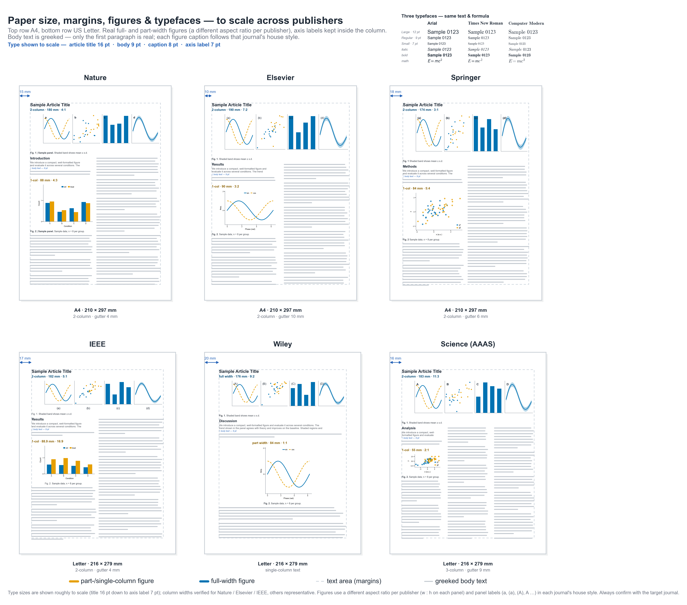

# Scientific Plotting & Presentation Conventions

A practical, matplotlib-focused reference for making figures that are
**publication-ready**, **legible**, and **editable** — with a ready-to-use style sheet and
to-scale schematics of how the major publishers expect figures to look.

> **The one rule that explains all the others:** *build the figure at the exact physical size
> it will be printed.* Set the size in **inches/mm**, the font in **points**, and what you see
> is what the reader gets — never draw big and shrink it in Word/LaTeX.



## What's inside

| File | What it is |
|---|---|
| **[`scientific_plotting_conventions.md`](scientific_plotting_conventions.md)** | The full guide — figure size, DPI, fonts, editable/vector output, colour, layout, slides, and a per-publisher reference (widths, resolution, fonts, **panel-label styles**), each with the matplotlib commands to enforce it. |
| **[`scientific.mplstyle`](scientific.mplstyle)** | A drop-in matplotlib style sheet encoding the defaults (Arial · 7 pt · Type-42 editable vector export · despined axes · Wong colour-blind-safe palette). |
| **[`publisher_page_layouts.py`](publisher_page_layouts.py)** | Generates the cross-publisher schematic above (Nature · Elsevier · Springer · IEEE · Wiley · Science), drawn to scale with real sample plots. |
| **[`journal_layout_schematic.py`](journal_layout_schematic.py)** | Generates a single-page "figure anatomy" schematic. |

## Quick start

```python
import matplotlib.pyplot as plt
plt.style.use("scientific.mplstyle")   # publication-ready defaults, one line

fig, ax = plt.subplots(figsize=(3.5, 2.16))   # single-column, ~golden ratio (inches)
ax.plot(x, y, label="data")
ax.set_xlabel("Time (s)")              # quantity + unit
ax.set_ylabel("Signal (a.u.)")
ax.legend()
fig.savefig("figure.pdf")              # vector + embedded editable fonts → submit this
```

To reproduce the schematics:

```bash
python publisher_page_layouts.py      # -> publisher_page_layouts.{pdf,png}
python journal_layout_schematic.py    # -> journal_layout_schematic.{pdf,png}
```
(Requirements: `python`, `numpy`, `matplotlib`. Arial improves the look but the scripts fall
back to a bundled sans-serif if it isn't installed.)

## Highlights of the guide

- **Size & aspect** — match the column grid (single ≈ 88 mm, double ≈ 180 mm); think in physical units.
- **Resolution & format** — export **vector** (PDF/EPS); 300 dpi photos, 600–1200 dpi line art when raster is unavoidable.
- **Editable text** — the **Type 3 vs Type 42** trap, and how to keep text selectable/embedded.
- **Fonts, lines, colour** — sans-serif at ~7 pt, colour-blind-safe **Wong/Okabe–Ito** palette, perceptually-uniform colormaps.
- **Per-publisher reference** — widths, resolution, fonts and **panel-label house styles** (`a`, `(a)`, `(A)`, `A` …), each with the matplotlib snippet to comply.

See **[`scientific_plotting_conventions.md`](scientific_plotting_conventions.md)** for the complete document.

## License

[MIT](LICENSE) © Jiutong Zhao
